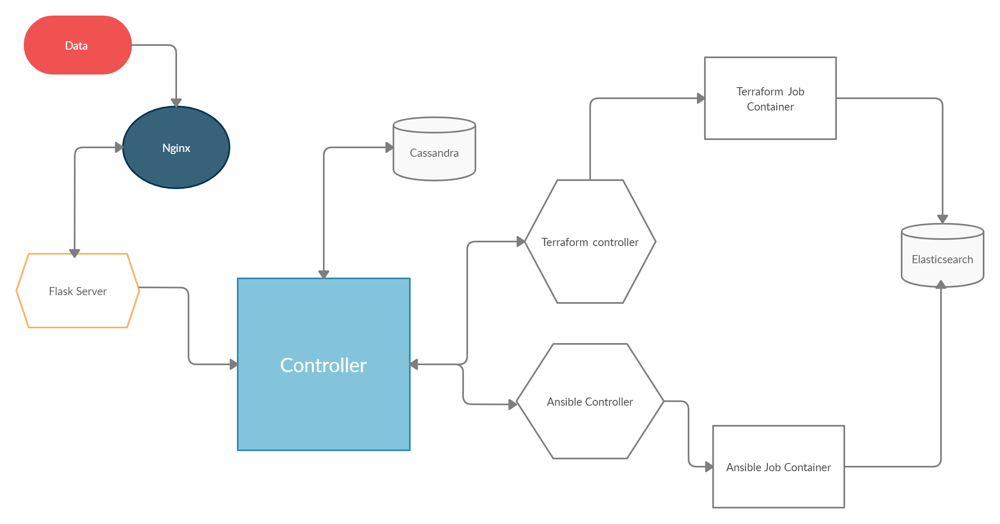

# raelvaes
1. Authentication with the API itself -> Correct Username and Password
2. /access/<string:cloud-provider-name> -> to authenticate with cloud provider AWS, Azure or using SSH/k8s
3. /execute/platform -> Platform
4. /execute/station -> 
5. /journey/start


# New Implementation
1. access.yaml hits the flask API and `Access` object is created.
    a. `Access` class receives the complete details and tests the connection (ssh for now).
    b. Creates an object with the same name as of the name in the metadata.
2. After this `Platform_flask` API gets the `Platform` object
    a. `Platform` class creates an object.
    b. object looks for `Access` information
    c. If `Access` information is present, perform the connection and use ansible module
    d. If `Access` information is not present, pass the `Platform` object to server decider
    e. After server decider pass the information to terraform
    f. Terraform creates the required resources.
    g. Ansible module deploys the required software.
            


Notes :
1. First an authentication to the API with the username and the password
2. Securing authentication to the VM, either SSH or AWS or k8s(for now)
3. Executing platform is preparing a VM for task deployments by creating a new machine from cloud access keys. Nothing is to be done when platform is to be SSHed.
4. A station can have multiple platforms, platforms are VMs, so station is nothing but a bunch of VM that you wish to pack together in a group.
5. The journey will begin from start( for e.g. Station 1) till end (for e.g. Station 5).


# Mechanism to connect using SSH
1. Using username and password
2. Key based 
```
## 1. Username

    POST /access/ssh
    {
        "type": "user-based"
        "username": "ubuntu"
        "password" : {
            "type": "secure"
            "hash": _________
        }
        "password": "
    }
 ```
 # Architecture
 
